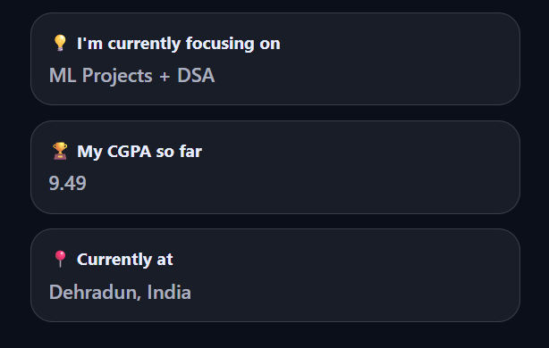
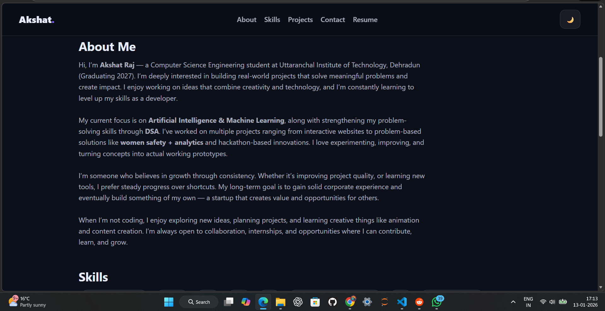

# 🚀 Akshat Raj — Portfolio Website

A clean, modern, and responsive **personal portfolio website** showcasing my projects, skills, and journey as a CSE student & aspiring **AI/ML Engineer**.

✨ Live Preview: *[(Click me !)](https://akshatsportfolioxd.netlify.app/)*  
📌 Repository: This repo contains the complete source code.

---

## 🌟 Highlights

✅ Minimal + Modern UI  
✅ Dark / Light Theme Toggle  
✅ Smooth Scrolling Navigation  
✅ Hover Glow Effects on Cards  
✅ Projects Showcase with Screenshots  
✅ Social Icons + Tooltip on Hover  
✅ Clean Contact Section + Resume CTA  
✅ Fully Responsive (Mobile + Desktop)

---

## 🖼️ Preview

> Add screenshots here (recommended)

```md


